# MiniBoard
---
주제 : 게시판 서비스를 제공하는 커뮤니티 사이트

개발기간 : 2021.11.30 ~ 2022.01.01

## 팀원소개 및 역할
---
##### [@nwlee7950](https://github.com/nwlee7950) [@cjscoding](https://github.com/cjscoding)

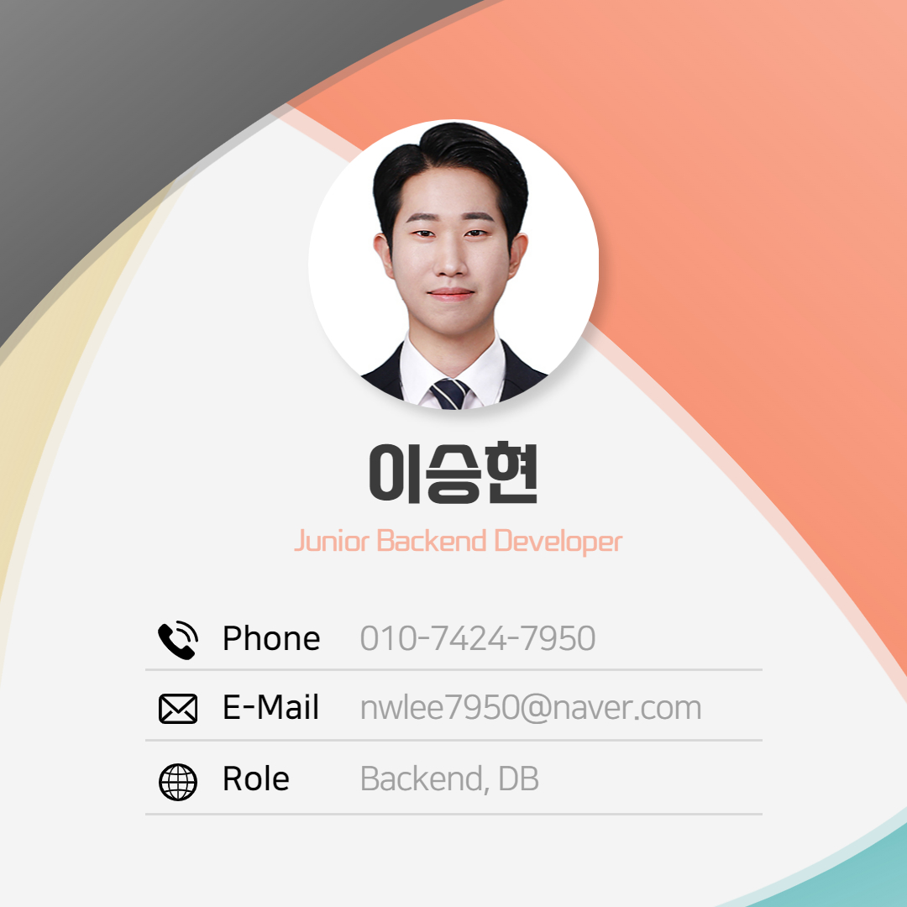 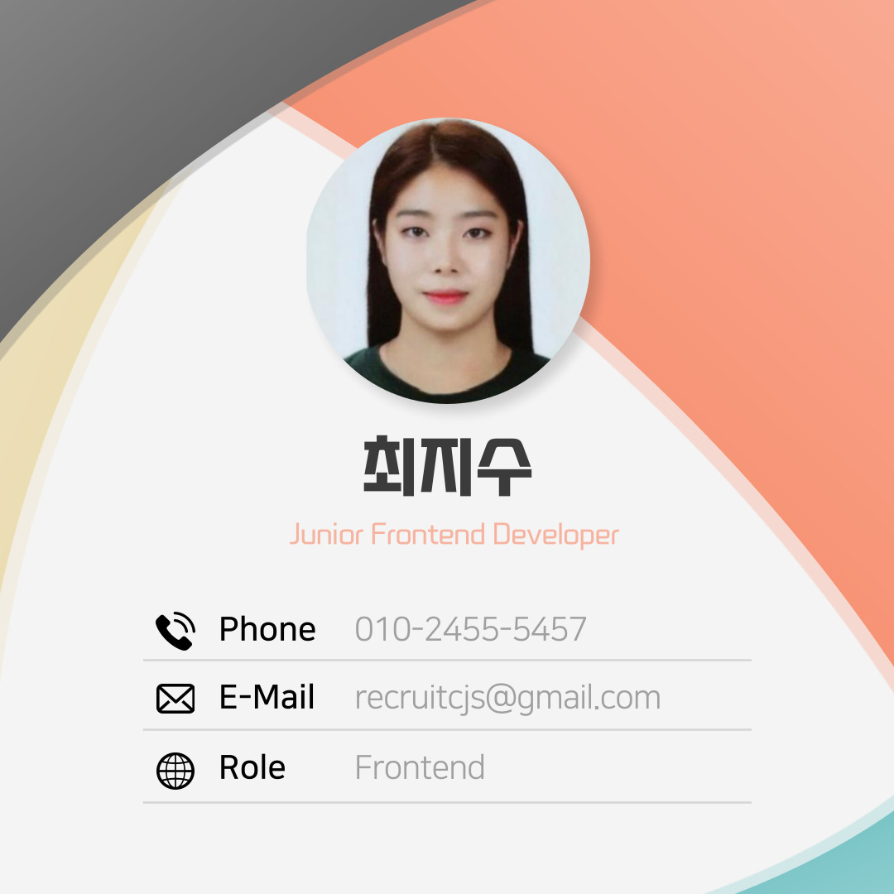

## 기술스택
---
#### 프론트엔드
•   

• 

• 

#### 백엔드
• 

•  

• 

#### 협업툴
• 

## 주요 기능
---

### 1. 홈
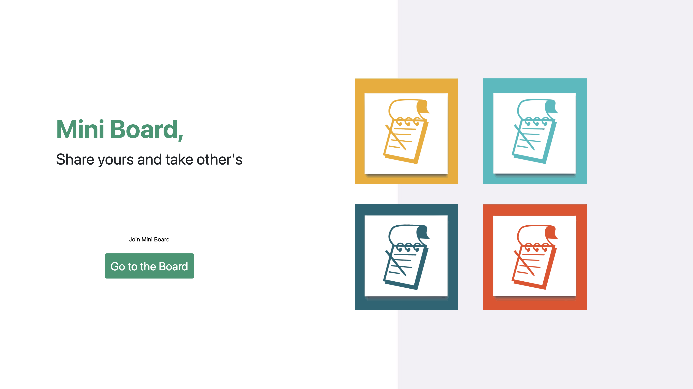

    • 환영 페이지를 보여줍니다.
    • 회원가입 또는 게시판으로 연결됩니다.

### 2. 회원가입

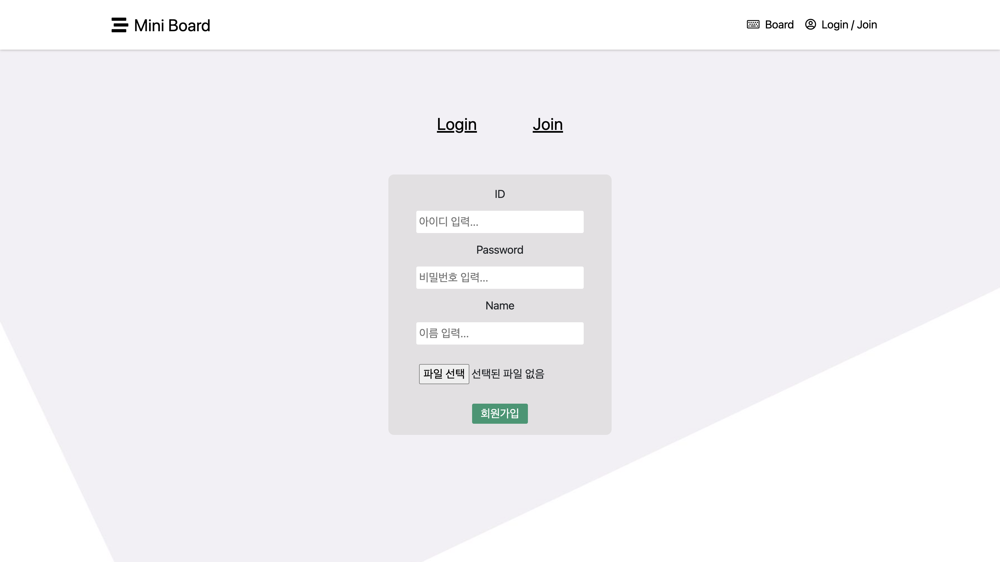

    • 아이디, 비밀번호, 이름, 프로필 이미지를 지정해 회원가입을 할 수 있습니다.

### 3. 로그인
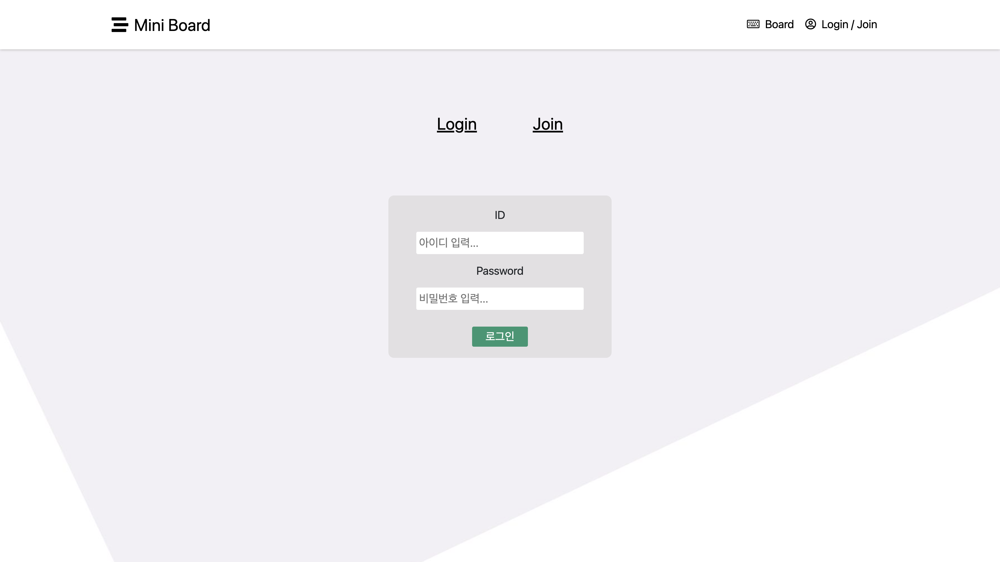

    • 아이디, 비밀번호로 로그인이 가능합니다.

### 4. 게시판
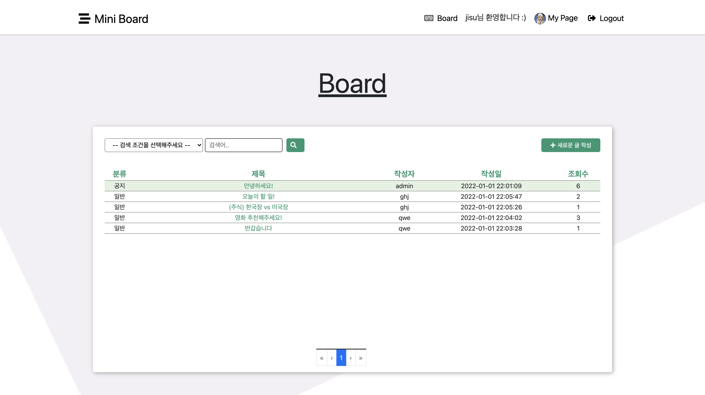

    • 사용자들이 정보를 교환할 수 있는 공간입니다.
    • 관리자가 쓴 글일 경우 공지사항으로 상위에 고정되어 보여집니다.

### 4-1. 게시판 글 필터링
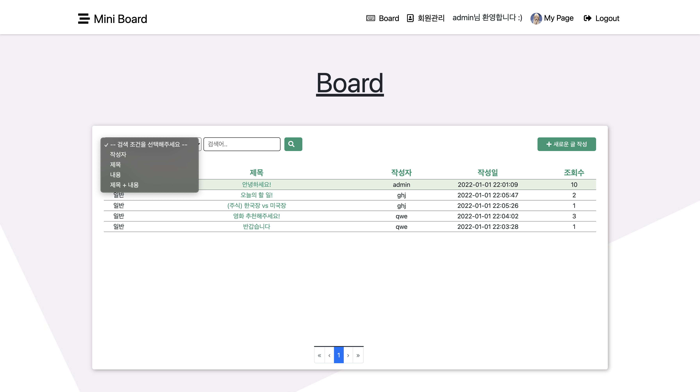
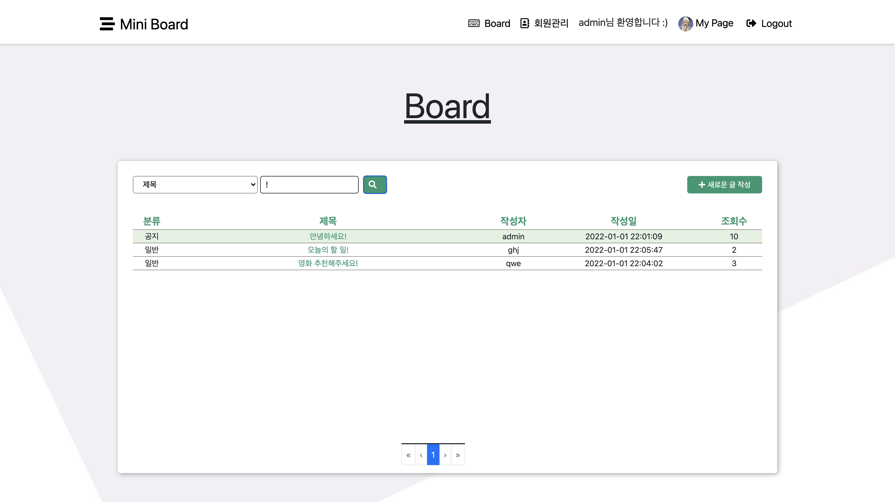

    • 작성자, 제목, 내용, 제목 + 내용 으로 검색 조건을 설정하여 글을 검색할 수 있습니다.

### 4-2. 게시판 글 상세보기
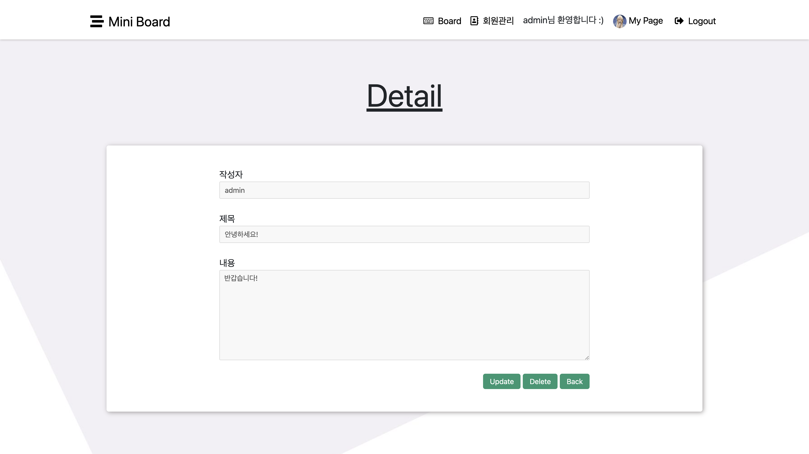

    • 글의 상세 내용을 확인할 수 있습니다.
    • update 버튼 클릭 시 글 수정 페이지로 연결됩니다.
    • update, delete는 해당 글의 작성자가 현재 로그인한 사용자일 경우에만 가능합니다.
    • 글을 삭제하게 되면 해당 글에 달린 모든 댓글과 대댓글 또한 삭제됩니다.

### 4-3. 게시판 수정하기
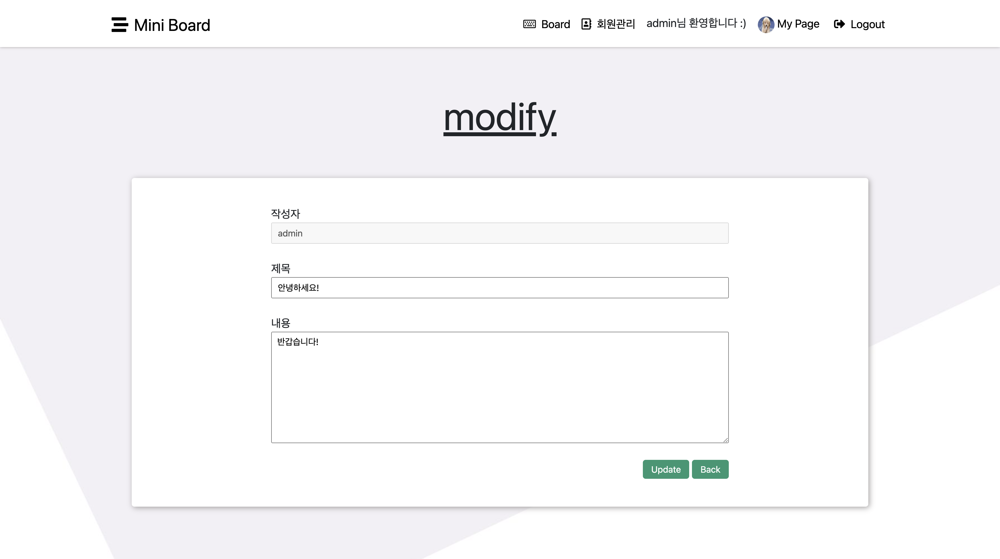

    • 작성자가 본인일 경우 글의 내용을 수정할 수 있습니다.

### 4-4. 게시판 댓글 대댓글
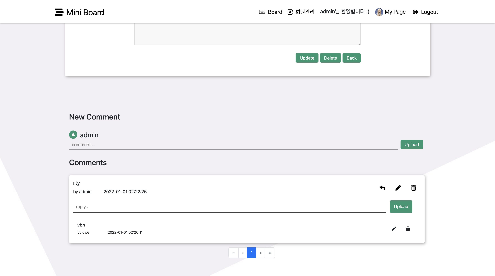

    • 해당 글에 대한 댓글과 대댓글이 보여집니다.
    • 모든 댓글과 대댓글은 작성자가 로그인한 사용자일 경우에만 수정 삭제가 가능합니다.

### 5. 회원관리
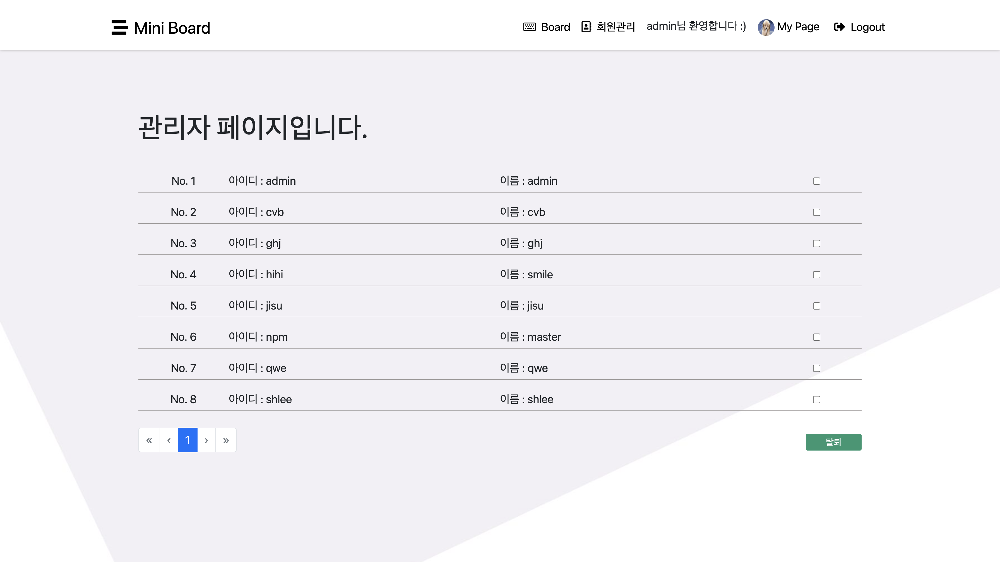

    • 로그인한 유저가 관리자일 경우에만 회원관리 페이지에 접근할 수 있습니다.
    • 회원들을 선택해 탈퇴시킬 수 있습니다.

### 6. 마이페이지
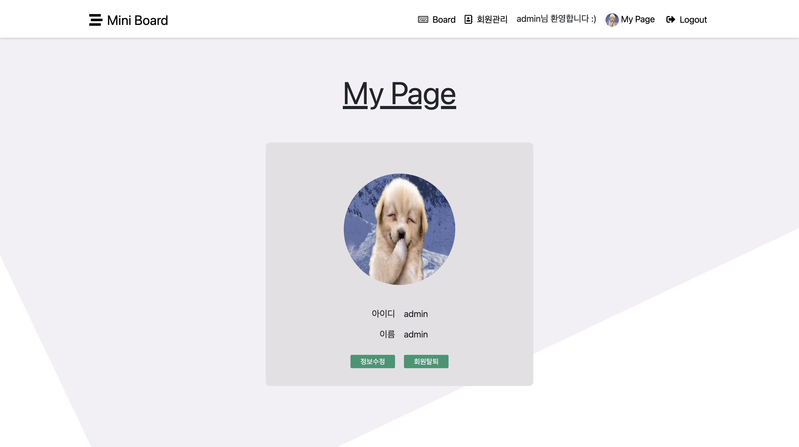

    • 사용자의 프로필 이미지, 아이디, 이름 정보를 확인할 수 있습니다.
    • 아이디를 제외한 회원 정보를 수정할 수 있으며 탈퇴할 수 있습니다.

## 기술 특장점
---

#### JWT(Json Web Token)을 이용한 토큰 기반 인증처리 구현
• 세션을 유지시킬 필요가 없기 때문에 서버의 자원을 절약할 수 있음(Stateless)

• 쿠키를 사용하지 않기 때문에 CSRF(Cross-site request forgery)공격을 방지할 수 있음

#### Spring Security를 이용한 보안성 강화
• 인증과 인가를 관리함으로써 보안성 강화

• BCrypt Password Encoder을 이용해 비밀번호를 암호화함으로써, 만약 보안이 뚫리더라도 비밀번호를 확인하기 어렵게 만듦

#### 빠른 인수인계를 위한 Swagger API 명세
• 사용되는 API들의 명세를 작성하여 Swagger 명세만 읽어도 협업, 유지보수 가능

• 별도의 문서 공유 없이 API서버에 Swagger를 배포하여 언제든 명세 확인 가능

## 아키텍처 및 ERD
---
• 아키텍처
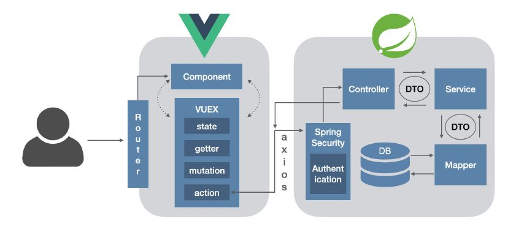

• ERD
